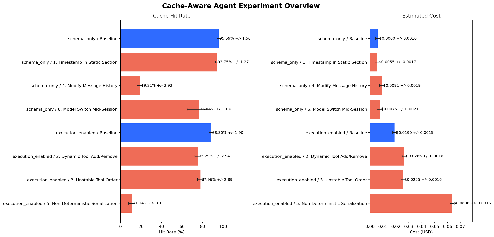
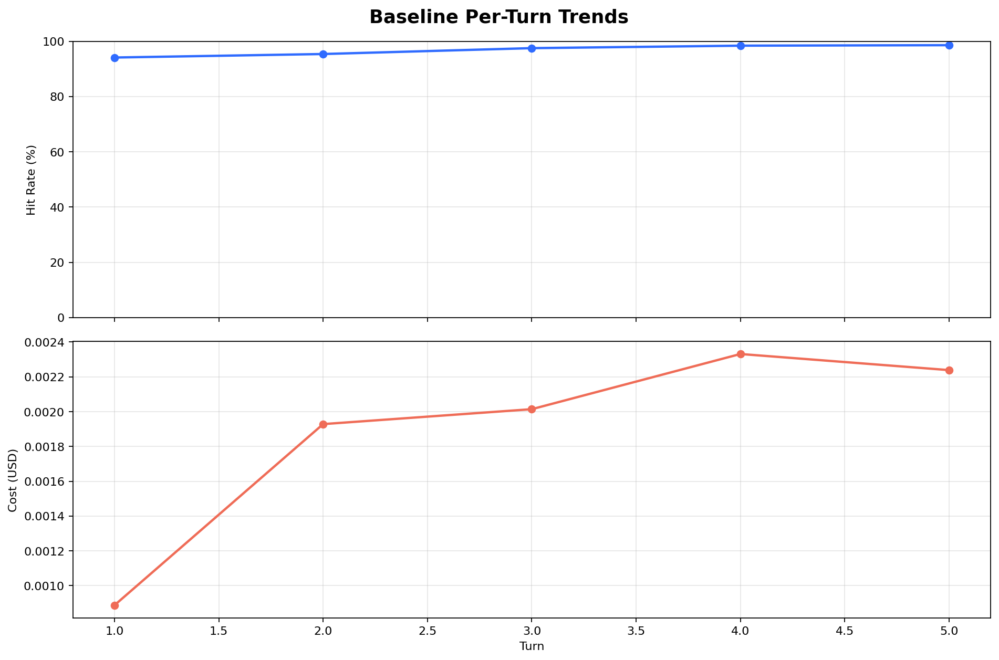

# Cache-Aware Agent Framework

受 Claude Code prompt 分层思路启发的缓存友好型 Agent 实验框架，用来验证 prompt 前缀稳定性、消息历史稳定性与 tool schema 稳定性如何影响缓存命中率、Token 消耗和 API 成本。

## 项目定位

这个项目当前聚焦两件事：

1. 设计一套适合 prompt caching 的多轮对话架构
2. 通过可重复实验量化常见 cache breaker 对命中率和成本的影响

当前版本的重点是：

- `prompt / message / tool schema` 稳定性验证
- 最小可用的 tool-calling 闭环
- 可重复、可观测、可视化的实验框架

它不是完整的生产级 agent orchestration 平台，但已经具备较强的实验和工程展示价值。

## 当前完成度

已完成：

- 静态 Prompt 与会话动态信息分层
- `BOUNDARY` 分界设计
- Append-only 消息历史管理
- 确定性 `tool schema` 缓存与序列化
- Session 配置锁存，避免会话中切换关键参数
- 最小可用的 tool-calling loop
- `schema-only` / `execution-enabled` 双轨实验设计
- 重复实验、聚合统计与结果可视化
- 工具执行层路径安全与结构化错误返回
- tool loop 可观测性：执行摘要、错误码、截断标记

当前支持的确定性本地工具：

- `echo_json` - 返回确定性 JSON 响应
- `list_directory` - 列出目录内容（按名称排序）
- `read_file` - 读取文件内容
- `search_content` - 在文件中搜索关键词
- `write_file` - 写入文件内容

当前未完成：

- 多轮复杂工具编排
- 面向生产场景的 agent 容错与调度

## 四层缓存友好架构

```text
Layer 1: Static System Prompt
  - 身份定义
  - 能力说明
  - 规则约束

Layer 2: Session-Specific Guidance
  - 当前日期
  - 模型信息
  - 工作目录
  - BOUNDARY 分界

Layer 3: Tool Definitions
  - 稳定的工具 schema
  - 按名称排序
  - 确定性 JSON 序列化

Layer 4: Append-Only Message History
  - user 消息
  - assistant 消息
  - tool 消息
```

核心代码：

- `core/prompt_manager.py`
- `core/message_manager.py`
- `core/tool_cache.py`
- `core/tool_executor.py`
- `core/agent.py`

## 实验设计

### Baseline

Baseline 代表正确的缓存友好实现，保持以下约束：

- 静态 Prompt 与动态会话信息分离
- 消息历史只追加，不修改
- 工具定义稳定
- 会话配置锁存

结果文件：

- `results/baseline_results.json`

### Cache Breakers

项目将 cache breaker 拆成两条更容易解释的轨道。

`schema-only`

- 不启用真实工具执行
- 重点观察 `prompt / message history / session config` 对缓存前缀的影响
- 场景包含：时间戳注入、修改历史消息、模型切换

`execution-enabled`

- 启用最小 `tool-calling` loop
- 基于 `read_file / echo_json` 这类确定性工具
- 重点观察工具集合、工具顺序、tool schema 稳定性对缓存的影响

结果文件：

- `results/cache_busters_results.json`
- `results/cache_busters_schema_only.json`
- `results/cache_busters_execution_enabled.json`

## 正式重复实验结果

正式实验配置：

- `turns = 5`
- `repeats = 5`
- `seed = 42`

### Baseline 主实验

`baseline.py` 的正式重复实验结果：

- Cache Hit Rate: `97.98% +/- 0.28%`
- Total Cost: `$0.0094 +/- $0.0015`

对应文件：

- `results/baseline_results.json`

### Schema-Only Track

Baseline：

- Cache Hit Rate: `95.59% +/- 1.56%`
- Total Cost: `$0.0060 +/- $0.0016`

关键破坏项：

- `Modify Message History`
  - Cache Hit Rate 降到 `19.21% +/- 2.92%`
  - 相对 baseline 下降 `76.38` 个百分点

- `Model Switch Mid-Session`
  - Cache Hit Rate 降到 `76.65% +/- 11.63%`

结论：

- 在不启用工具执行时，消息历史稳定性仍然是影响缓存的最强因素
- 时间戳注入会伤害缓存，但远弱于直接修改历史消息

### Execution-Enabled Track

Baseline：

- Cache Hit Rate: `88.30% +/- 1.90%`
- Total Cost: `$0.0190 +/- $0.0015`

关键破坏项：

- `Non-Deterministic Serialization`
  - Cache Hit Rate 降到 `11.14% +/- 3.11%`
  - 相对 baseline 下降 `77.16` 个百分点

- `Dynamic Tool Add/Remove`
  - Cache Hit Rate 降到 `75.29% +/- 2.94%`

- `Unstable Tool Order`
  - Cache Hit Rate 降到 `77.96% +/- 2.89%`

结论：

- 当工具调用进入前缀后，`tool schema` 的确定性会显著影响缓存效果
- 非确定性序列化是 execution-enabled 轨道中最强的 cache breaker

### Tool Observability

正式实验中的 `execution-enabled` 轨道还记录了工具执行观测指标：

- 工具执行成功率：`100%`
- `max_tool_rounds` 截断次数：`0`
- 错误码分布：`none`
- 执行工具：`read_file`

这意味着：

- 本轮结果不是由工具执行失败导致
- 命中率差异主要来自前缀结构和 schema 稳定性变化，而不是执行噪声

完整摘要与图表：

- `results/experiment_summary.md`
- `results/figures/cache_overview.png`
- `results/figures/baseline_turns.png`

## README 展示素材

### Cache Overview



### Baseline Per-Turn Trends



## 结果解读边界

为了避免过度包装，当前版本的结论边界如下：

- 这个项目已经验证了 `prompt prefix / message history / session config / tool schema` 稳定性对缓存命中率和成本的影响
- 当前已实现最小可用的 tool-calling loop，但还不是完整生产级 tool agent
- `execution-enabled` 轨道适合说明“真实工具调用场景下的结构稳定性问题”，但不等同于复杂 agent 编排平台验证
- 成本不仅受命中率影响，也受 prompt / completion token 数量影响，因此局部场景可能出现“命中率下降但总成本变化不完全同步”的情况

## 运行方式

### 安装

```bash
uv pip install -r requirements.txt
```

### 正式实验

```bash
python experiments/baseline.py --turns 5 --seed 42 --repeats 5
python experiments/cache_busters.py --track all --turns 5 --seed 42 --repeats 5
python experiments/visualize_results.py
```

### 工程验证 / Smoke Test

```bash
python experiments/baseline.py --turns 1 --seed 42 --repeats 1 --output-dir results/dev_smoke
python experiments/cache_busters.py --track all --turns 1 --seed 42 --repeats 1 --output-dir results/dev_smoke
python experiments/visualize_results.py --results-dir results/dev_smoke
```

### 单独运行某一轨道

```bash
python experiments/cache_busters.py --track schema_only --turns 5 --seed 42 --repeats 5
python experiments/cache_busters.py --track execution_enabled --turns 5 --seed 42 --repeats 5
```

### 测试

```bash
.venv\Scripts\python -m unittest discover -s tests
```

当前测试覆盖数：`27`

## 当前 Tools 状态

项目已经实现第一版最小 tool-calling 闭环：

- assistant 返回 `tool_calls`
- 本地执行工具
- 追加 `tool` role 消息
- 再次请求模型生成最终回答

当前工具层还有这些工程特性：

- 所有工具仅允许访问工作区内文件（路径安全检查）
- 工具返回统一结构：`status / output / error`
- `list_directory` 返回按名称排序的条目，保证确定性
- `search_content` 返回行号和匹配内容
- `write_file` 自动创建父目录
- trace 中记录工具执行摘要、错误码、是否被 `max_tool_rounds` 截断

默认情况下 tools 不启用，因此不会影响 baseline / schema-only 实验。

手动启用最小 tool loop：

```python
from core.agent import CacheAwareAgent

agent = CacheAwareAgent(
    enable_tools=True,
    max_tool_rounds=1,
)
```

## 项目结构

```text
cache/
├── core/
│   ├── agent.py
│   ├── message_manager.py
│   ├── prompt_manager.py
│   ├── tool_cache.py
│   └── tool_executor.py
├── experiments/
│   ├── baseline.py
│   ├── cache_busters.py
│   ├── experiment_utils.py
│   └── visualize_results.py
├── results/
│   ├── baseline_results.json
│   ├── cache_busters_results.json
│   ├── cache_busters_schema_only.json
│   ├── cache_busters_execution_enabled.json
│   ├── experiment_summary.md
│   └── figures/
├── tests/
├── requirements.txt
└── README.md
```

## 技术栈

- Python 3.12
- DeepSeek API
- OpenAI-compatible SDK
- `python-dotenv`
- `matplotlib`

## 简历写法参考

一句话版本：

> 设计并实现了一个受 Claude Code 启发的 cache-aware agent framework，通过双轨 cache breaker 实验量化验证 prompt 前缀稳定性、消息历史稳定性与 tool schema 稳定性对缓存命中率和 API 成本的影响。

简历 bullet 版本：

- 设计 Cache-Aware Agent 架构，将多轮对话拆分为静态 Prompt、会话动态信息、稳定 tool schema 与 append-only message history 四层，以提高 prompt caching 命中率与可解释性。
- 实现最小可用的 tool-calling 闭环与本地工具执行层，为 `read_file` 增加工作区路径安全限制，并建立结构化错误返回与 tool loop trace 观测机制。
- 构建 `schema-only` 与 `execution-enabled` 双轨 cache breaker 实验框架，支持重复实验、聚合统计与结果可视化；在正式 `5x5` 重复实验中，`Modify Message History` 将 schema-only 命中率从 `95.59%` 降至 `19.21%`，`Non-Deterministic Serialization` 将 execution-enabled 命中率从 `88.30%` 降至 `11.14%`。

## 后续可扩展方向

- 扩展更多安全、确定性的本地工具
- 实现多轮复杂 tool-call loop
- 增加更细粒度的 tool observability 仪表盘
- 对不同模型、不同 turns / repeats 配置做参数敏感性分析
